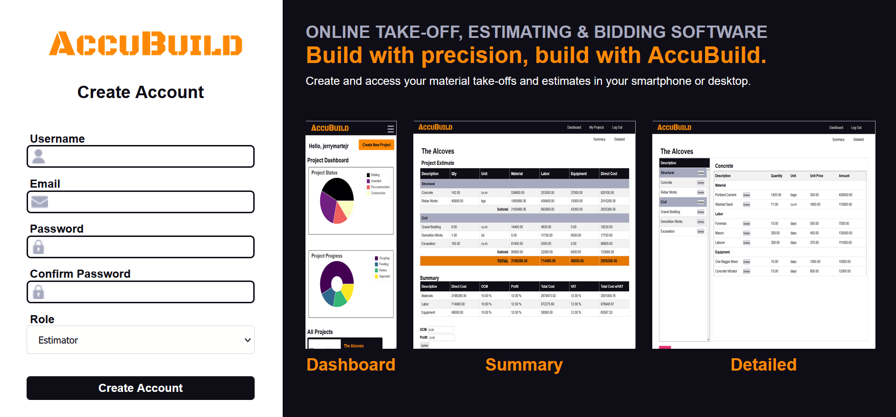
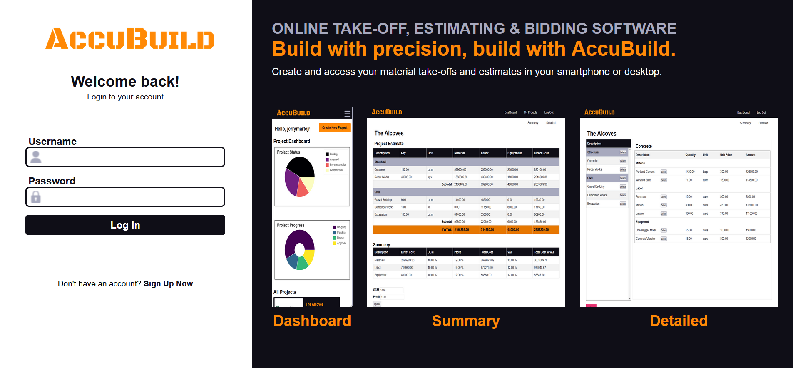
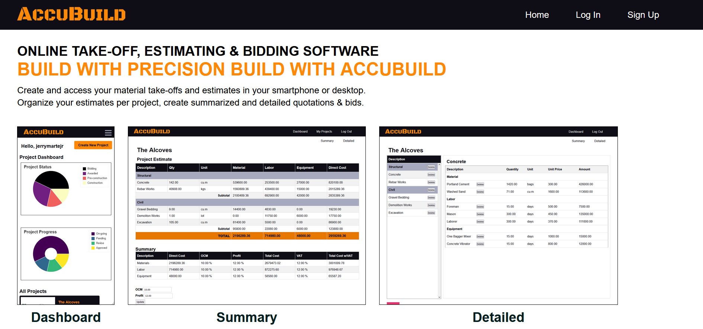
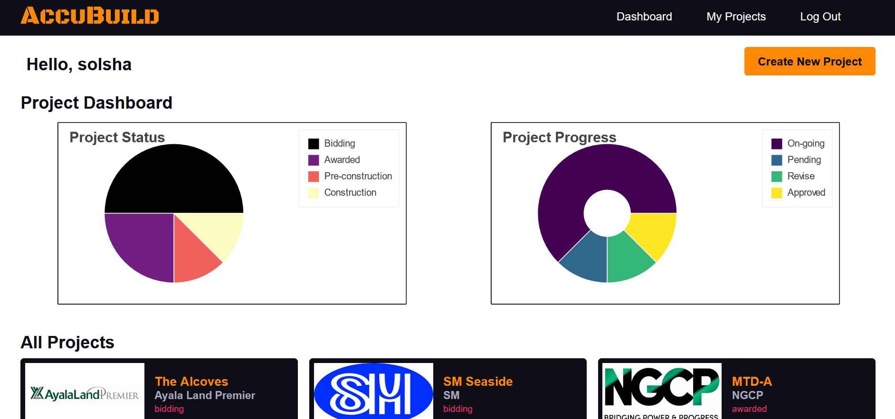
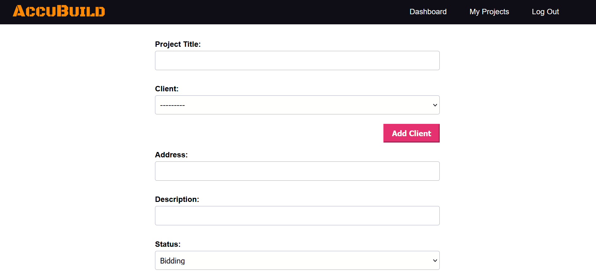
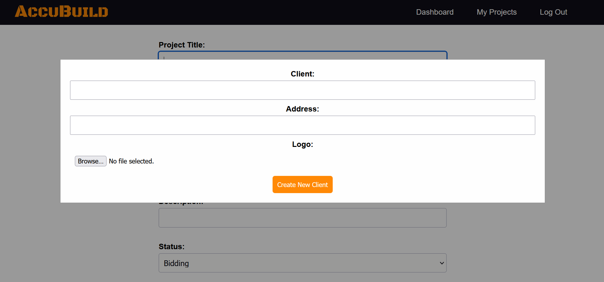
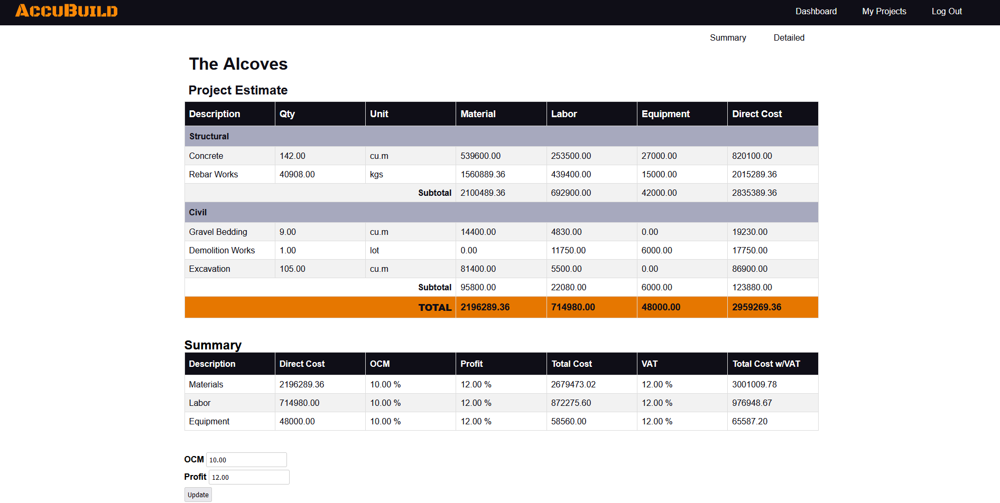
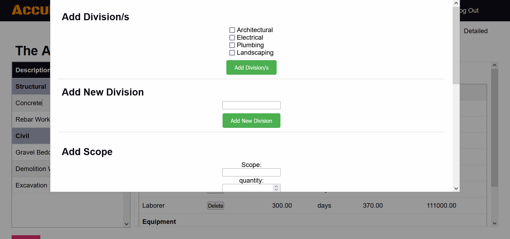
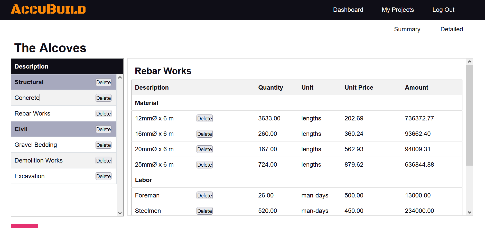

# **AccuBuild**
### Video Demo: https://youtu.be/yUIWw67Qrmw

<hr>

## Description
**AccuBuild** is a web app where construction professionals (engineers, architects, contractors, subcontractors, etc.) can use for cost estimates and project management for construction projects. It provides a detailed and summarized cost estimate.

## Distinctiveness and Complexity
For distinctiveness, my app is in no way similar to the other projects of this course. It is not an e-commerce site, it is not a social network and it also not an email system. AccuBuild can be considered a project management and cost estimating web app.

## Why I Developed This App
I developed this app as a complement to my other project **iStruktura**. iStruktura is a structural design web app, then ideally, after designing a project, the project cost needs to be estimated for bidding purposes. This app will be useful to many construction professionals since it has a user friendly interface, and it provides both detailed ans summarized cost estimate.

## Technologies Used
+ **Django** - Backend
+ **Bokeh** - Interactive visualization library in python (used in creating and rendering the dashboard charts)
+ **Pillow** - Adds image processing capabilities (used when uploading client logos)
+ **HTML** - Frontend
+ **CSS** - Frontend
+ **JavaScript** - Frontend

## App Files and Features
### models.py
Contains the app fields and data stored
+ **User** - Model for user with role of either 'estimator' or 'manager'
+ **Client** - Model for clients. Includes an image field for the client's logo
+ **Projects** - Model for the projects.
+ **Division** - Model for the project divisions (ex. Structural, Architectural, etc.)
+ **DivisionCost** - Model for the cost of the division.
+ **Scope** - Model for the projects scopes under a division (ex. Concrete, Excavation, Painting)
+ **ItemType** - Model for the item type (material, labor, equipment)
+ **Item** - Model for the project items under a scope (ex. Cement, Foreman, Plywood, Paint)

### forms.py
Contains the forms to add, update and delete project data.

### urls.py
Contains the paths/routes that map to the view functions

### views.py
Contains the view functions
+ **register** - Let's a user register for an account. It lets the user choose their role in the project, estimator (the one who creates and adds data to a project) or manager (the onew who checks and approves the project)
<br>


+ **login_view** - Logs the user in.
<br>


+ **logout_view** - Logs the user out.
+ **index** - Home Page
<br>


+ **dashboard** - The dashboard can only be accessed when the user is authenticated. It shows two charts, the project status and the project progress. The charts are created and rendered using `Bokeh`. The dashboard also shows all the projects.
<br>


+ **create_new_project** - Only a user with the role of 'estimator' can access this view function. It let's a user create a new project.
<br>


+ **add_new_client** - While in the create new project page, the user can add a new client if the client of the project is new (not in the dropdown list choices). It pops up as a modal, and uses JavaScript to add the new client without leaving the create new project page.
<br>


+ **project** - Shows a summarized table of the project's cost estimate. The user can **update_markup** the OCM and profit % here. This is also where a user (estimator) can **submit_for_approval** to the project manager. Then the manager can either **approve_project** or **reject_project** and add comments/notes for the estimator.
<br>


+ **detailed** - This is where the user can **add_divisions**, **remove_division**, **add_scope**, **add_new_division**, **remove_scope**, **add_item** and **remove_item**. When a scope is clicked, the scopes items will be displayed on a table using JavaScript and **get_scope_items**.
<br>

<br>


+ **estimator_projects** - This where the user with the role of 'estimator' can view their projects.

+ **manager_projects** - This where the user with the role of 'manager' can view their projects.

### main.js
Contains the main JavaScript codes for the app's frontend

### styles.css
Contains the css to style the html

### /templates/estimate
Contains the html files with Jinja that the view functions will render.

## Installation
1. Make sure Python is installed in your machine
2. Clone the repository to your machine.
```
https://github.com/me50/jerrymartejr.git
```
3. Create a python virtual environment (optional)
4. Install the packages
```
pip install -r requirements.txt
```
5. Run server
```
python manage.py runserver
```
6. Migrate the database
```
python manage.py makemigrations
python manage.py migrate
```


